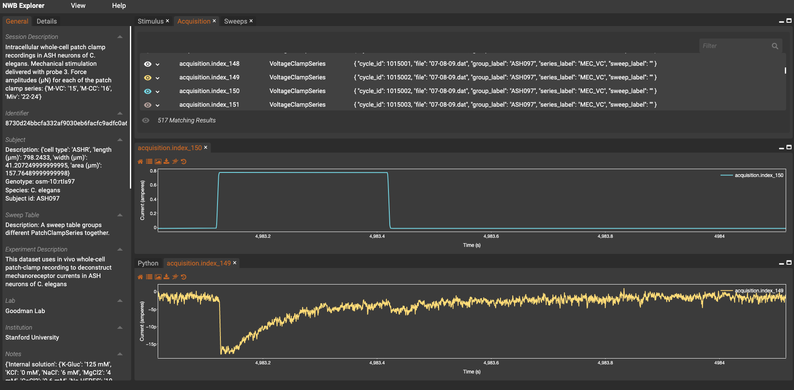

# Wormsense Lab Data - ASH

Electrophysiological recordings of [ASH neuron](https://www.wormatlas.org/neurons/Individual%20Neurons/ASHframeset.html) from [Wormsense Lab](https://med.stanford.edu/goodmanlab.html) of Miriam Goodman.

This code uses a metadata spreadsheet and .dat files acquired from the HEKA Patchmaster software to generate NWB files with experimental data.

Example converted data file shown here:



### How to use

The data can be converted by running the following command while in the src directory:

```python
python goodman_to_nwb_conversion.py
``` 

This `goodman_to_nwb_conversion.py` file can be edited to convert additional datasets, overwrite existing files, or use other metadata spreadsheets (see example below).

```python
    metadata_filename = '..//test_data//ASH-metadata_12_III_29.xls'
    cell_list = ['ASH097', 'ASH116', 'ASH230', 'ASH287']
    overwrite = True

    convert_goodman_to_nwb(metadata_filename, cell_list, overwrite)
```

The x_to_nwb module used to convert .dat files to .nwb format was forked from [byte-physics/x_to_nwb](https://github.com/byte-physics/x-to-nwb) and adapted to be compatible with data acquired from older Patchmaster versions (pre v2x90). This module has also been adapted to support a metadata input that can be used to incorporate additional experiment information when generating the NWB file.

### Current state of the project

Note, data is in the process of being moved here from https://github.com/OpenSourceBrain/GSoC_2021_OSB_NWB.

Current outstanding question and remaining to-do items for a fully converted dataset are described in the documentation: [doc/dat_to_nwb_testing.md](doc/dat_to_nwb_testing.md)

