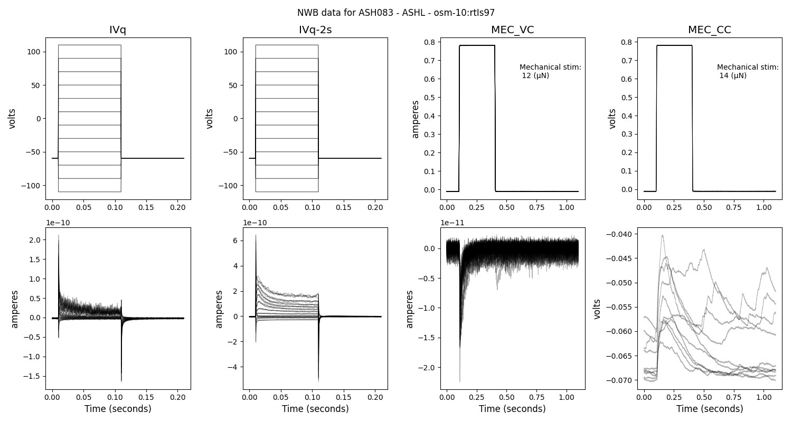
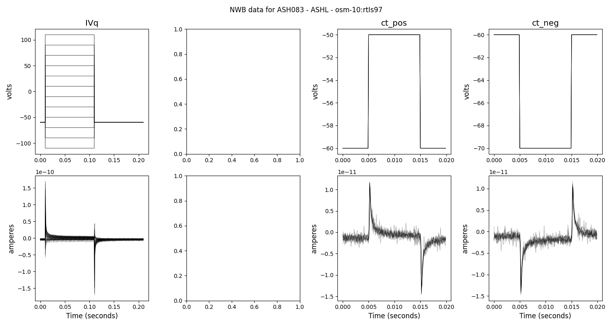
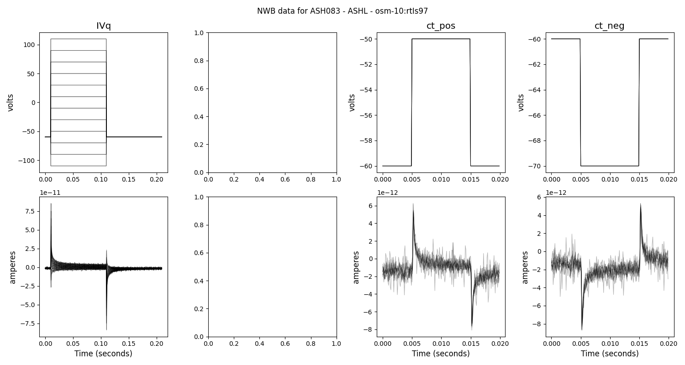
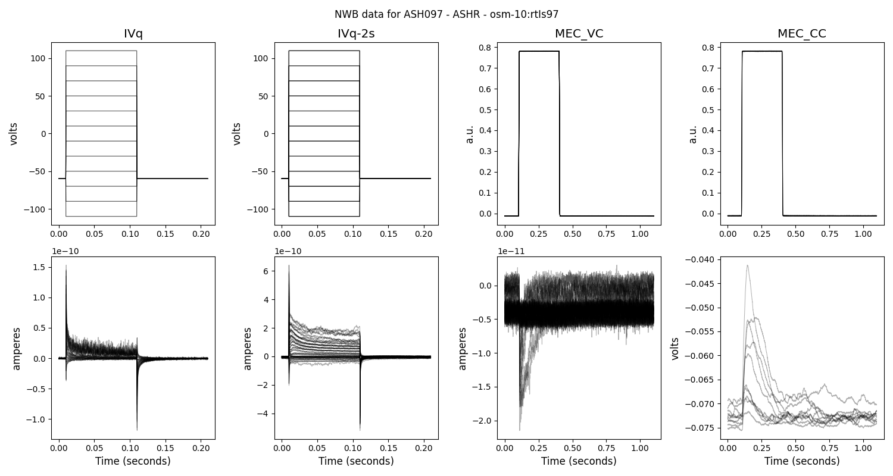
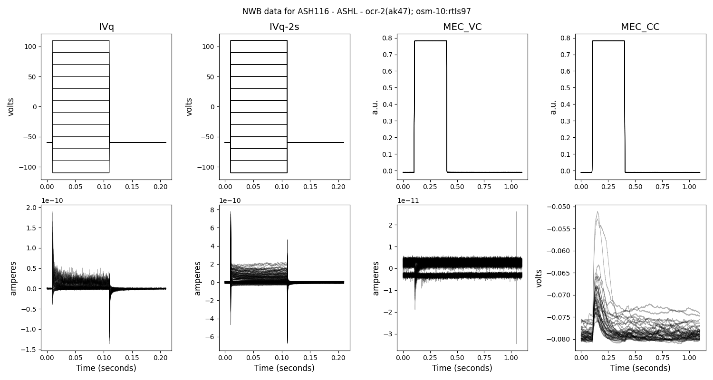
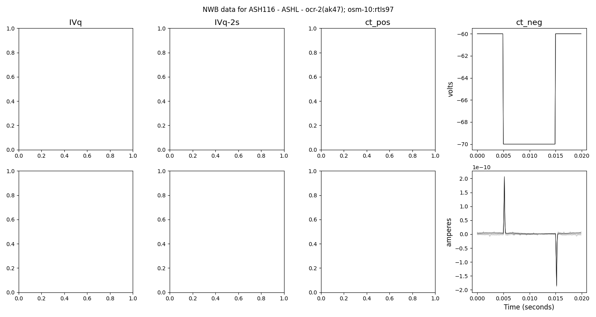
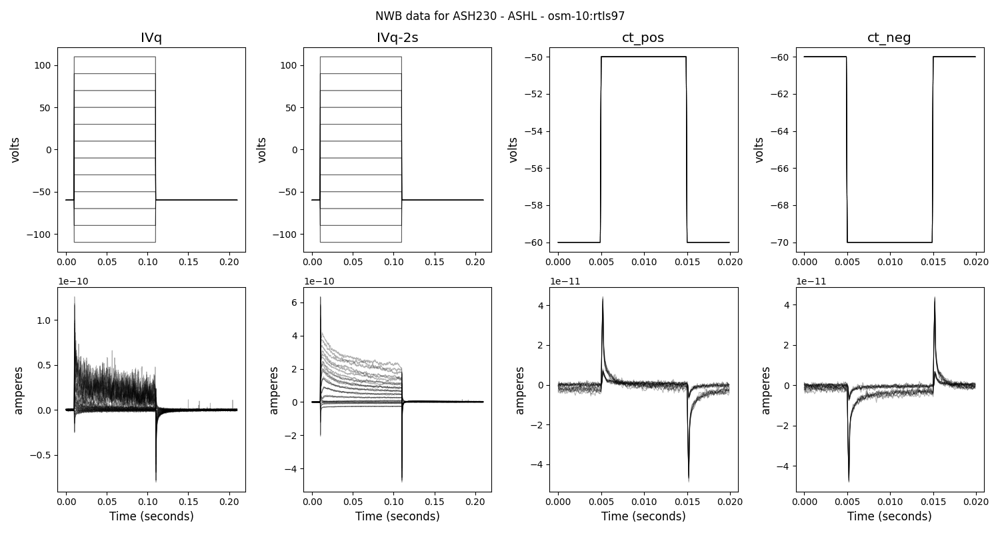
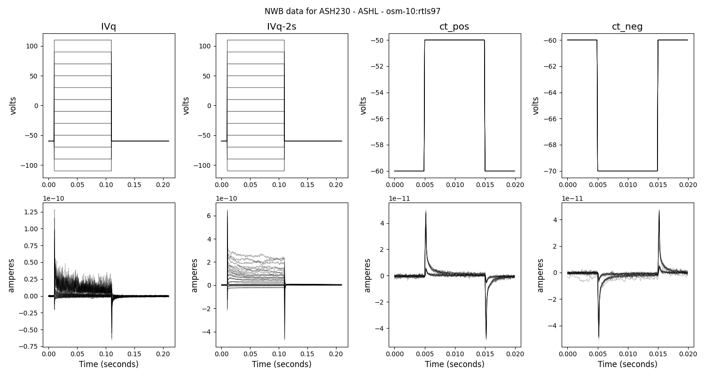
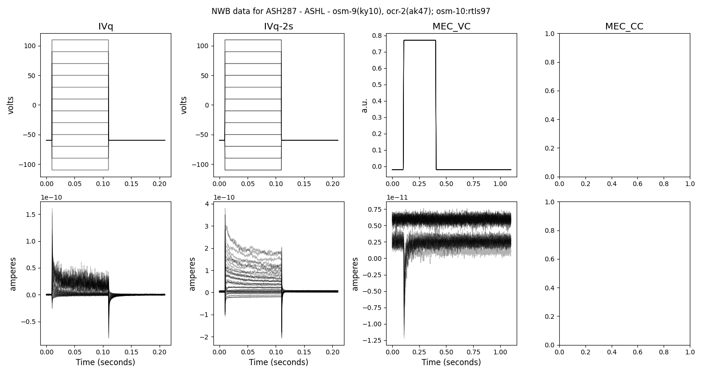
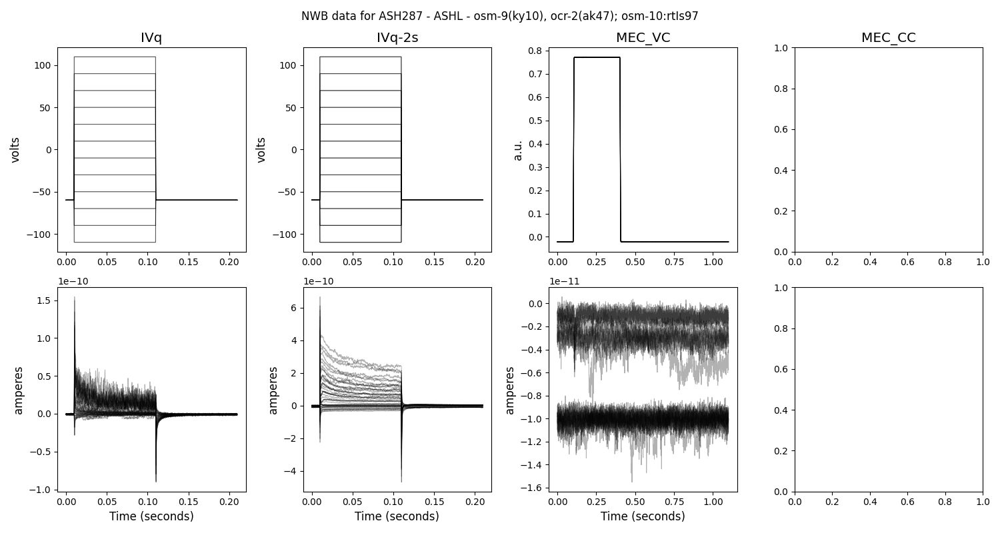

# Example datasets converted to NWB format

 [07-06-25-1](#07-06-25-1) | [07-06-25-2](#07-06-25-2) | [07-06-25-3](#07-06-25-3) | [07-08-09-1](#07-08-09-1) | [08-02-21-1](#08-02-21-1) | [08-02-21-2](#08-02-21-2) | [08-10-30-1](#08-10-30-1) | [09-03-31-1](#09-03-31-1) | [09-03-31-2](#09-03-31-2) | [09-04-23-1](#09-04-23-1) | [09-04-23-2](#09-04-23-2) | [09-04-23-3](#09-04-23-3) | [09-04-23-4](#09-04-23-4) | [09-07-15-1](#09-07-15-1) | [09-07-15-2](#09-07-15-2) | [10_03_19-1](#10_03_19-1) | [10_03_19-2](#10_03_19-2)

## 07-06-25-1

[NWB file containing data](07-06-25-1.nwb) |
[View on NWB Explorer on Open Source Brain](http://nwbexplorer.opensourcebrain.org/hub/nwbfile=https://github.com/openworm/WormsenseLab_ASH/raw/main/test_data/07-06-25-1.nwb)

## 07-06-25-2

[NWB file containing data](07-06-25-2.nwb) |
[View on NWB Explorer on Open Source Brain](http://nwbexplorer.opensourcebrain.org/hub/nwbfile=https://github.com/openworm/WormsenseLab_ASH/raw/main/test_data/07-06-25-2.nwb)

## 07-06-25-3

[NWB file containing data](07-06-25-3.nwb) |
[View on NWB Explorer on Open Source Brain](http://nwbexplorer.opensourcebrain.org/hub/nwbfile=https://github.com/openworm/WormsenseLab_ASH/raw/main/test_data/07-06-25-3.nwb)

## 07-08-09-1

[NWB file containing data](07-08-09-1.nwb) |
[View on NWB Explorer on Open Source Brain](http://nwbexplorer.opensourcebrain.org/hub/nwbfile=https://github.com/openworm/WormsenseLab_ASH/raw/main/test_data/07-08-09-1.nwb)

## 08-02-21-1

[NWB file containing data](08-02-21-1.nwb) |
[View on NWB Explorer on Open Source Brain](http://nwbexplorer.opensourcebrain.org/hub/nwbfile=https://github.com/openworm/WormsenseLab_ASH/raw/main/test_data/08-02-21-1.nwb)

## 08-02-21-2

[NWB file containing data](08-02-21-2.nwb) |
[View on NWB Explorer on Open Source Brain](http://nwbexplorer.opensourcebrain.org/hub/nwbfile=https://github.com/openworm/WormsenseLab_ASH/raw/main/test_data/08-02-21-2.nwb)

## 08-10-30-1

[NWB file containing data](08-10-30-1.nwb) |
[View on NWB Explorer on Open Source Brain](http://nwbexplorer.opensourcebrain.org/hub/nwbfile=https://github.com/openworm/WormsenseLab_ASH/raw/main/test_data/08-10-30-1.nwb)

## 09-03-31-1

[NWB file containing data](09-03-31-1.nwb) |
[View on NWB Explorer on Open Source Brain](http://nwbexplorer.opensourcebrain.org/hub/nwbfile=https://github.com/openworm/WormsenseLab_ASH/raw/main/test_data/09-03-31-1.nwb)

## 09-03-31-2

[NWB file containing data](09-03-31-2.nwb) |
[View on NWB Explorer on Open Source Brain](http://nwbexplorer.opensourcebrain.org/hub/nwbfile=https://github.com/openworm/WormsenseLab_ASH/raw/main/test_data/09-03-31-2.nwb)

## 09-04-23-1

[NWB file containing data](09-04-23-1.nwb) |
[View on NWB Explorer on Open Source Brain](http://nwbexplorer.opensourcebrain.org/hub/nwbfile=https://github.com/openworm/WormsenseLab_ASH/raw/main/test_data/09-04-23-1.nwb)

## 09-04-23-2

[NWB file containing data](09-04-23-2.nwb) |
[View on NWB Explorer on Open Source Brain](http://nwbexplorer.opensourcebrain.org/hub/nwbfile=https://github.com/openworm/WormsenseLab_ASH/raw/main/test_data/09-04-23-2.nwb)

## 09-04-23-3

[NWB file containing data](09-04-23-3.nwb) |
[View on NWB Explorer on Open Source Brain](http://nwbexplorer.opensourcebrain.org/hub/nwbfile=https://github.com/openworm/WormsenseLab_ASH/raw/main/test_data/09-04-23-3.nwb)

## 09-04-23-4

[NWB file containing data](09-04-23-4.nwb) |
[View on NWB Explorer on Open Source Brain](http://nwbexplorer.opensourcebrain.org/hub/nwbfile=https://github.com/openworm/WormsenseLab_ASH/raw/main/test_data/09-04-23-4.nwb)

## 09-07-15-1

[NWB file containing data](09-07-15-1.nwb) |
[View on NWB Explorer on Open Source Brain](http://nwbexplorer.opensourcebrain.org/hub/nwbfile=https://github.com/openworm/WormsenseLab_ASH/raw/main/test_data/09-07-15-1.nwb)

## 09-07-15-2

[NWB file containing data](09-07-15-2.nwb) |
[View on NWB Explorer on Open Source Brain](http://nwbexplorer.opensourcebrain.org/hub/nwbfile=https://github.com/openworm/WormsenseLab_ASH/raw/main/test_data/09-07-15-2.nwb)

## 10_03_19-1

[NWB file containing data](10_03_19-1.nwb) |
[View on NWB Explorer on Open Source Brain](http://nwbexplorer.opensourcebrain.org/hub/nwbfile=https://github.com/openworm/WormsenseLab_ASH/raw/main/test_data/10_03_19-1.nwb)

## 10_03_19-2

[NWB file containing data](10_03_19-2.nwb) |
[View on NWB Explorer on Open Source Brain](http://nwbexplorer.opensourcebrain.org/hub/nwbfile=https://github.com/openworm/WormsenseLab_ASH/raw/main/test_data/10_03_19-2.nwb)
